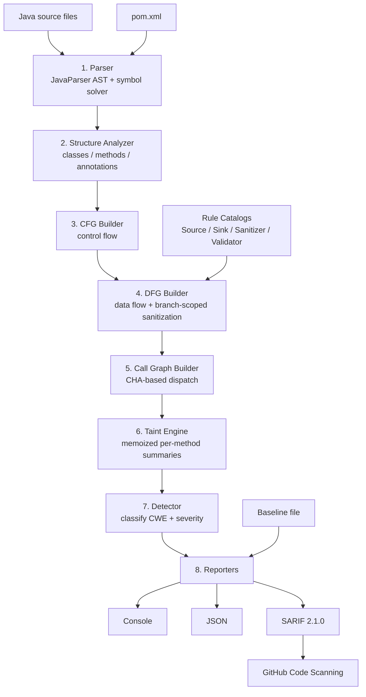

# SpringTaintEngine

[](https://github.com/minhthanh-it05/SpringTaintEngine/actions/workflows/ci.yml)
[](LICENSE)
[](https://openjdk.org/projects/jdk/21/)

A self-implemented static taint-analysis engine for **Java / Spring MVC** code. Given a
project's source tree, it traces how untrusted HTTP input (`@RequestParam`, `@RequestBody`,
`@PathVariable`, ...) flows through the code and reports every path that reaches a dangerous
sink (JDBC, `Runtime.exec`, `RestTemplate`, deserialization, ...) without passing through a
recognized sanitizer — a CWE-tagged, source-to-sink finding with the full hop-by-hop trace.

It solves the same class of problem as CodeQL/Semgrep's security rule packs, but scoped
narrowly to Spring MVC injection vulnerabilities and built **entirely from scratch**: there is
no off-the-shelf SAST/dataflow library underneath. Every stage — control-flow graph, data-flow
graph, call graph, interprocedural taint propagation — is implemented in this repository, on
top of [JavaParser](https://github.com/javaparser/javaparser)'s AST.

**Contents:** [Architecture](#architecture) · [Features](#features) ·
[Detection coverage](#detection-coverage) · [Build & run](#build--run) ·
[Benchmark](#benchmark) · [Trade-offs & limitations](#trade-offs--limitations) ·
[Testing](#testing)

## Architecture



| # | Stage | Package | What it does |
|---|---|---|---|
| 1 | Parse | `parser` | Load source into ASTs; resolve real types via Maven's classpath |
| 2 | Structure | `structure` | Extract classes / methods / parameters / annotations |
| 3 | CFG | `cfg` | Per-method control-flow graph |
| 4 | DFG | `dfg` | Per-method data-flow graph + branch-scoped sanitization |
| 5 | Call Graph | `callgraph` | Whole-project call graph, CHA-based dispatch fan-out |
| 6 | Taint | `taint` | Memoized per-(method, parameter) summary propagation |
| 7 | Detect | `detect` | Classify findings into CWE + severity, fingerprint each |
| 8 | Report | `report` | Console / JSON / SARIF 2.1.0 output |
| — | Rules | `rules` | Source / Sink / Sanitizer / Validator catalogs |
| — | Baseline | `baseline` | Mark previously-accepted findings as suppressed |

## Features

- **Interprocedural, unbounded-depth taint propagation.** Each `(method, parameter)` pair is
  analyzed once into a reusable summary (which sinks it reaches, whether its return value is
  tainted); callers reuse it instead of re-walking the callee. No fixed call-chain depth cap,
  and no cross-talk between unrelated callers of the same shared method.
- **Branch-scoped sanitizer validation.** `if (StringUtils.isNumeric(x)) { sink(x); }` and the
  guard-clause form `if (!valid(x)) return;` are both recognized — the variable is only treated
  as clean on the branch actually proven to have passed the check.
- **Real classpath resolution.** For Maven projects, asks `mvn dependency:build-classpath` for
  the real dependency jars so library calls (Spring, JDBC, ...) resolve by type instead of by
  guessed simple name.
- **CHA-based interprocedural dispatch**, sanitizer-aware taint propagation, and constructor /
  collection / lambda / switch-expression handling — see each package's Javadoc for the
  documented trade-offs behind every one of these.
- **Baseline / suppression for CI.** `--write-baseline` snapshots current findings by a stable
  fingerprint (independent of line numbers and run-to-run id reshuffling); `--baseline` marks
  matching findings as suppressed on later scans — visible in every report, excluded only from
  `--fail-on-findings` gating. SARIF output uses the spec's native `suppressions` field, so
  GitHub Code Scanning honors it directly.
- **CI/CD-ready out of the box**: SARIF 2.1.0 + `--fail-on-findings` exit-code gating +
  a working GitHub Actions workflow (`.github/workflows/ci.yml`) that uploads results straight
  to GitHub Code Scanning.

### Detection coverage

| Vulnerability | CWE | Example sink | Sink signatures |
|---|:---:|---|:---:|
| SQL Injection | CWE-89 | `Statement.executeQuery` | 11 |
| Command Injection | CWE-78 | `Runtime.exec` | 1 |
| Server-Side Request Forgery | CWE-918 | `RestTemplate.getForObject` | 6 |
| Cross-Site Scripting | CWE-79 | `PrintWriter.println` | 2 |
| Path Traversal | CWE-22 | `new FileInputStream(path)` | 6 |
| Insecure Deserialization | CWE-502 | `ObjectInputStream.readObject` | 1 |

*(27 sink signatures total across these 6 categories — full list in `rules.SinkCatalog`.)*

| Catalog | Count | Examples |
|---|:---:|---|
| Sources | 6 | `@RequestParam`, `@PathVariable`, `@RequestBody`, `@RequestHeader` |
| Sanitizers | 15 | `Integer.parseInt`, `HtmlUtils.htmlEscape`, `StringEscapeUtils.escapeHtml4` |
| Validators | 2 | `StringUtils.isNumeric`, `Pattern.matches` (branch-scoped only — see Features) |

All four catalogs (`rules.SourceCatalog`, `rules.SinkCatalog`, `rules.SanitizerCatalog`,
`rules.ValidatorCatalog`) are plain data classes — extending detection coverage is adding a
line, not touching the engine.

## Build & run

The Maven project lives in the `SpringTaintEngine/` subdirectory of this repo:

```bash
cd SpringTaintEngine
mvn test     # run the test suite (127 tests)
mvn package  # produces target/SpringTaintEngine-*.jar (runnable, dependencies bundled)

java -jar target/SpringTaintEngine-*.jar <project-dir> [options]
```

If no argument is given, it scans the bundled sample project at `src/main/resources/samples`.

### CLI options

```
--format=<f1,f2,...>    Output formats: console, json, sarif (default: console)
--out=<prefix>          Output file prefix for json/sarif (default: taint-report)
--fail-on-findings      Exit with status 1 if any HIGH/CRITICAL finding is reported
                        (findings in the baseline never count toward this)
--baseline=<path>       Mark findings already in this file as suppressed
--write-baseline=<path> Write every finding from this run to the baseline file
--debug                 Also dump structure/CFG/DFG/call graph internals
--help, -h              Show usage
```

Scan a project and emit both a human-readable report and a SARIF file for GitHub Code
Scanning / VS Code's SARIF viewer, failing the build on any serious new finding:

```bash
java -jar target/SpringTaintEngine-*.jar path/to/your/spring-project \
    --format=console,sarif --out=target/taint-report --fail-on-findings
```

Accept everything currently found as a baseline, then gate CI on new findings only:

```bash
# once, after reviewing the current findings:
java -jar target/SpringTaintEngine-*.jar path/to/your/spring-project \
    --write-baseline=taint-baseline.txt
git add taint-baseline.txt   # commit it

# every CI run after that:
java -jar target/SpringTaintEngine-*.jar path/to/your/spring-project \
    --baseline=taint-baseline.txt --fail-on-findings
```

### Sample output

```
Taint analysis report - 4 finding(s)
============================================================
[SQL_INJECTION-1] HIGH - SQL Injection (CWE-89)
  Untrusted input from parameter 'name' (@RequestParam) in UserController.search/1 flows into Statement.executeQuery/1 at `statement.executeQuery(sql)` without sanitization.
  source: UserController.search/1 (src/main/resources/samples/UserController.java:16)
  sink:   Statement.executeQuery/1
  path:
    -> UserController.search/1 #0 PARAM: name
    -> UserController.search/1 #2 CALL: userService.findByName(name)
    -> UserService.findByName/1 #0 PARAM: name
    -> UserService.findByName/1 #2 EXPRESSION: "SELECT * FROM users WHERE name = " + name
    -> UserService.findByName/1 #1 ASSIGN: sql = "SELECT * FROM users WHERE name = " + name
    -> UserService.findByName/1 #5 CALL: statement.executeQuery(sql)
```

The path above crosses two files (`UserController` → `UserService`) — this is interprocedural
propagation via a memoized summary, not a single-method match.

## Benchmark

Measured on 200 hand-picked [OWASP Benchmark](https://owasp.org/www-project-benchmark/) v1.2
test cases (4 CWE categories this engine supports: SQLi, Command Injection, Path Traversal,
XSS), scored against the benchmark's own ground truth. Semgrep, CodeQL, PMD, and Insider were
run for real, on the *exact same 200 files* and the *exact same ground truth* — not quoted from
their own marketing numbers.

| CWE | SpringTaintEngine | Semgrep | CodeQL* | PMD | Insider |
|---|---|---|---|---|---|
| SQLi (CWE-89) | **100% / 62.5%** | 65.7% / 62.2% | 85.7% / 58.8% | 0% / — | 0% / — |
| Command Injection (CWE-78) | **100% / 54.4%** | 61.3% / 59.4% | 58.1% / 60.0% | 0% / — | 100% / 53.4% |
| Path Traversal (CWE-22) | **100% / 45.8%** | 95.5% / 48.8% | 36.4% / 47.1% | 0% / — | 0% / — |
| XSS (CWE-79) | **100% / 75.0%** | 0% / — | 0% / — | 0% / — | 0% / — |
| **Total** | **100% / 58.0%** | 56.2% / 56.2% | 50.0% / 57.1% | 0% / — | 27.7% / 53.4% |

*(format: Recall / Precision)*

**Honest caveats, not hidden:**
- **PMD**: scored 0% because its community edition genuinely has no taint-flow engine for these
  CWEs (confirmed with canonical, unobfuscated test files) — not a fair like-for-like tool, kept
  here only for completeness.
- **Insider**: pattern-matches `Runtime.exec`/`ProcessBuilder` presence with no taint tracking at
  all — flags every Command Injection *category* file (safe or not) identically, hence 100%
  recall with mediocre precision on that one CWE and 0% on the rest (no rules exist for them).
- **CodeQL**\*: self-run under `--build-mode=none` (no compiler available for this corpus), which
  measurably understates its real capability — a reference run from an academic paper
  ([arXiv:2601.22952](https://arxiv.org/abs/2601.22952)) on a properly-built project reports
  **97.0% / 60.3%**. Its 0% on XSS here is a confirmed harness artifact (this engine's synthetic
  `PrintWriter out` parameter, added so *our own* engine could detect the sink without full type
  resolution) — CodeQL does detect the canonical `response.getWriter().println()` form.
- **Semgrep**'s 0% XSS is a genuine free-tier rule gap, verified against canonical syntax too.
- **SonarQube** could not be self-run (no Docker in the test environment); the same academic
  paper reports SonarQube Community v9.9.8 at Recall 95.6% / Precision 51.9% on the *full*
  2740-case benchmark (not filtered to these 4 CWEs) — cited as reference only, not a like-for-like row.

Read: SpringTaintEngine trades precision for **guaranteed recall** within its narrow scope; the
general-purpose tools trade the reverse, and cover far more ground outside that scope (see
Limitations below).

## Trade-offs & limitations

This engine deliberately favors **recall over precision** and a working end-to-end pipeline over
exhaustive coverage. Documented honestly, not hidden in the fine print:

### Scope
- **Spring MVC only.** Sources are 6 Spring MVC annotations. Spring WebFlux (`Mono`/`Flux`),
  `@KafkaListener`/`@RabbitListener`, WebSocket handlers, and plain Servlet API
  (`request.getParameter()` without an annotation) are not recognized as sources at all.
- **6 CWEs, injection-flow only.** No XXE, NoSQL/LDAP injection, hardcoded secrets, weak crypto,
  or dependency/SCA scanning — the things every general-purpose SAST tool also checks.
- **Maven only.** Classpath resolution shells out to `mvn dependency:build-classpath`; Gradle
  projects fall back to syntactic (simple-name) resolution.

### Analysis precision
- **CHA-based dispatch, not points-to.** An interface/abstract call fans out to every concrete
  override found in the parsed sources, not the one actually injected at runtime.
- **Flow-insensitive within a method**, except for the two branch-scoped validators above —
  other conditional logic merges via a synthetic `MERGE` node rather than tracking per-branch
  state precisely.
- **Recursion** is broken with a conservative empty-summary placeholder, not a full fixed-point
  iteration — a sink reachable *only* by unwinding a recursive call chain can be missed (rare in
  Spring MVC request-handling code, which this engine targets).
- **Sanitizer/Validator catalogs are curated, fixed lists** of well-known library APIs — a
  project's own in-house validation helpers, or Bean Validation annotations (`@Pattern`/`@Valid`
  on a DTO field — a different, declarative mechanism entirely), are not recognized.
- **No template-engine awareness.** Thymeleaf/FreeMarker auto-escaping is invisible — this
  engine only reads `.java` files.

### Scale
- **Whole project is parsed into memory at once** before analysis starts; no batching or
  streaming. Verified against the raw 2740-file OWASP Benchmark source tree: completes in ~23s
  with a default heap, but needs **at least ~1GB of heap** — below ~768MB, JavaParser itself
  throws `OutOfMemoryError` while parsing (not this engine's own analysis logic).
- Functional accuracy has been validated on small-to-medium real projects (a 5-file deliberately
  vulnerable app, a 49-file reference Spring Boot app) — not yet on a large real codebase with
  hundreds of Spring-annotated endpoints.
- Only 200 of the OWASP Benchmark's 2740 cases have been scored end-to-end, limited by the
  narrow regex-based source-pattern recognition of the benchmark-conversion script used to build
  ground truth — not a limitation of the engine itself.

### Tooling
- CLI only — no IDE plugin, no dashboard, no finding-history tracking over time (the baseline is
  a point-in-time snapshot, not a continuously updated view).
- Single language (Java).

## Testing

```bash
cd SpringTaintEngine && mvn test
```

127 tests exercise every stage of the pipeline independently (CFG/DFG/call graph builders, all
four rule catalogs, the taint engine's summary computation and context-precision, baseline
round-tripping, each reporter) as well as end-to-end scenarios against the bundled sample
project and, during development, against a real deliberately-vulnerable Spring Boot project
([malikashish8/vuln-spring](https://github.com/malikashish8/vuln-spring)).
